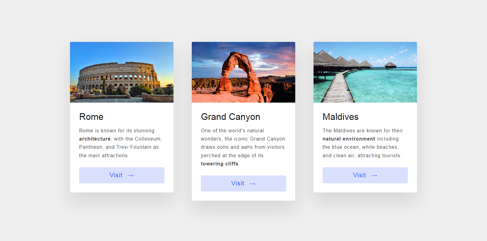

# Visit Web Page

This is a simple web page showcasing different travel destinations with information about each location. The project uses HTML and CSS for the layout and styling.

## Screenshot



## Getting Started
These instructions will help you set up and run the project on your local machine.

1. Clone the repository:
   ```bash
   git clone https://github.com/your-username/your-repository.git
   ```   
2. Open the index.html file in your web browser.

## Features
- Information about different travel destinations.
- Each destination has an image, description, and a "Visit" button.

## Contributing
If you'd like to contribute to this project, follow these steps:

1. Fork the repository.
2. Create a new branch (```bash git checkout -b feature/your-feature ```).
3. Commit your changes (```bash git commit -m 'Add some feature' ```).
4. Push to the branch (```bash git push origin feature/your-feature ```).
5. Create a new pull request.
